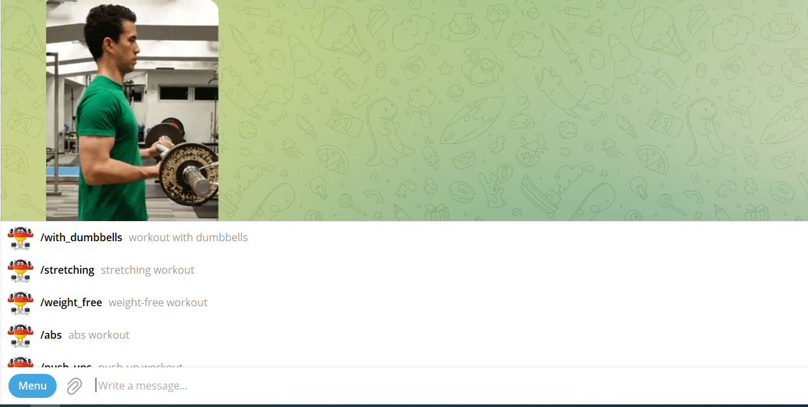
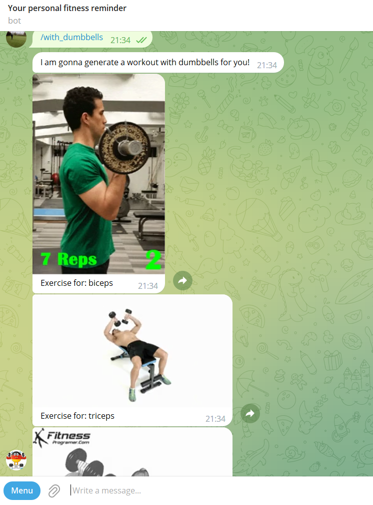

# Your personal Fitness bot

## Overview.
There are a few grammatical errors and some sentences could be rephrased for clarity. Here's a corrected version:

Fitness Reminder is a simple and easy-to-use Telegram bot that generates workouts for end-users. With its vast collection of exercises, like dumbbells, weight-free exercises, and abs exercises, the bot provides a wide range of workout options to choose from.

Whether you're looking to tone your muscles or simply want to stay active, Fitness Reminder has got you covered. All you need to do is send a command and the bot will send respective GIFs with instructions. It's that simple!

With regular reminders and alerts, the bot ensures that you never miss a workout and stay motivated to achieve your fitness goals. To access the bot, you can contact me on Telegram at @AntonSK98 and I will grant you access.

write to me today to get access to Fitness Reminder and take the first step towards a healthier, happier you!

### List of commands

### Bot in action

### Demo

## Some technical info
Fitness Reminder was implemented using [Telegram's Bot API](https://core.telegram.org), which provides developers with a convenient way to create custom Telegram bots.

The bot utilizes Telegram's message handler to receive commands from users and handles them based on the *Chain of Responsibility design pattern*. This bot is private and can be used only by authorized users! To get an access to the bot you should contact the owner.

